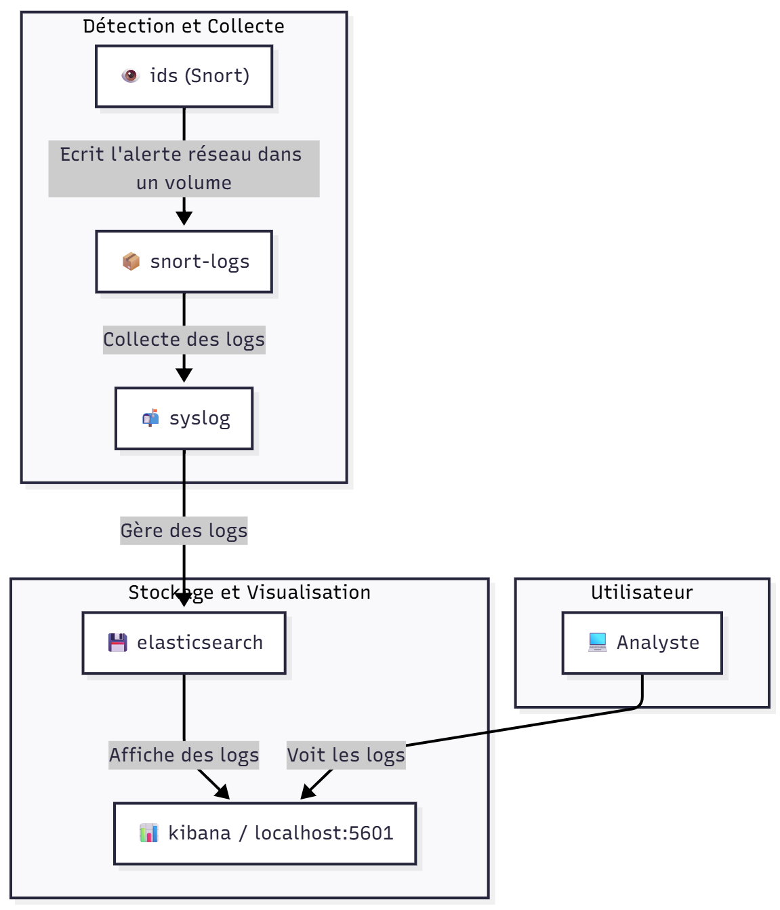

# Projet détection d'anomalies par logs avec Docker : Snort et Syslog-ng

Ce projet déploie un système complet de gestion des informations et des événements de sécurité en utilisant Docker. Il intègre **Snort** pour la détection d'intrusions, la **pile Elastic (Elasticsearch et Kibana)** pour l'agrégation et la visualisation des logs, et **syslog-ng** comme transitaire de logs central.

L'ensemble de l'environnement est conteneurisé, ce qui le rend facile à déployer, à gérer et à faire évoluer.

## 📁 Structure du Projet

Voici l'arborescence des fichiers et dossiers du projet.

```
PROJETPRATIQUECYBER/
├── docker/
│   ├── elasticsearch/
│   |   ├── config/
│   |   │   └── elasticsearch.yml
│   |   └── Dockerfile
│   ├── ids/
│   │   ├── config/
│   │   │   ├── local.rules
│   │   │   └── snort.conf.template
│   │   ├── configure_and_run.sh
│   │   └── Dockerfile
│   ├── kibana/
│   │   ├── config/
|   |   |   └── kibana.yml
│   │   └── Dockerfile
│   ├── server/
│   |   ├── config/
|   |   |   └── syslog-ng-client.conf
│   |   └── Dockerfile
│   ├── ssh_brutforce/
│   |   ├── ssh_bruteforce.sh
│   |   └── Dockerfile
│   └── syslog/
│       ├── config/
│       │   └── syslog-ng.conf
│       ├── Dockerfile
│       └── start.sh
├── docs/
|   ├──attacks/
|   |   └──attacks.md : Justication et description de nos attaques
│   └── images/
│       ├── diagram.png
│       ├── step 1.png
│       ├── ... (autres images)
├── scripts-attacks/
├── docker-compose.yml
└── README.md
```


## 🏛️ Architecture

Ce projet utilise une configuration Docker multi-conteneurs orchestrée avec `docker-compose`.

* **Snort (`snort`)** : Le système de détection d'intrusions (IDS) qui surveille le trafic réseau. Il est configuré pour fonctionner en mode IDS et écouter sur l'interface `eth0`. Toutes les alertes sont écrites dans le fichier `/var/log/snort/alert.fast`.
* **Syslog-ng (`syslog-ng`)** : Ce conteneur lit les alertes générées par Snort et les transfère directement à Elasticsearch pour l'indexation.
* **Elasticsearch (`elasticsearch`)** : Un puissant moteur de recherche et d'analyse qui stocke et indexe les logs envoyés par syslog-ng.
* **Kibana (`kibana`)** : La couche de visualisation de la pile ELK. Elle fournit une interface web pour explorer, rechercher et visualiser les données de logs stockées dans Elasticsearch.

<br>
    

## 📋 Prérequis

Cette méthode est compatible avec **Linux**, **macOS** et **Windows (via WSL 2)**.

Avant de commencer, vous devez installer **Docker Engine** et **Docker Compose**.

### Windows

1.  Assurez-vous que **WSL 2** est activé sur votre système.
2.  Téléchargez et installez **Docker Desktop for Windows** depuis le site officiel :
    * [https://www.docker.com/products/docker-desktop/](https://www.docker.com/products/docker-desktop/)

### macOS

Téléchargez et installez **Docker Desktop for Mac** depuis le site officiel. Le programme d'installation inclut Docker Engine et Docker Compose.
* [https://www.docker.com/products/docker-desktop/](https://www.docker.com/products/docker-desktop/)

### Linux (Distributions basées sur Debian/Ubuntu)

Ouvrez un terminal et exécutez les commandes suivantes pour installer Docker Engine et Docker Compose.

```bash
# Mettre à jour la liste des paquets
sudo apt-get update

# Installer Docker Engine et Docker Compose
sudo apt-get install docker.io docker-compose -y
```

## 🚀 Installation et Lancement avec Docker

Une fois que vous disposez des fichiers du projet sur votre machine, suivez ces étapes pour lancer l'environnement conteneurisé.

Ouvrez un terminal et naviguez jusqu'au répertoire racine de ce projet. C'est le dossier qui contient le fichier `docker-compose.yml` puis exécutez cette commande : 

```bash
docker-compose up --build
```

Si jamais vous voulez stopper notre service : 
```bash
docker-compose down
```

## 🛠️ Configuration de Kibana

Après avoir lancé les conteneurs, configurez Kibana pour visualiser les alertes.

### 1. Accéder à l'interface de Kibana

Patientez une à deux minutes que les services démarrent, puis ouvrez votre navigateur web et naviguez vers **`http://localhost:5601`**.


### 2. Créer une Vue de Données (Data View)

Vous allez indiquer à Kibana où trouver les données que `syslog-ng` envoie à Elasticsearch.

1.  Cliquez sur **Explore On My Own**.
    <br>
    

2.  Dans le menu de gauche (icône ☰), naviguez vers **Management > Stack Management**.
    <br>
    
    <br>
    

3.  Dans la section "Kibana", cliquez sur **Data Views**.
    <br>
    

4.  Cliquez sur le bouton **Create Data View**.
    <br>
    

5.  Dans les champs "Name" et "Index pattern", tapez exactement **`snort-*`**. Kibana devrait confirmer qu'il a trouvé un index correspondant.

6.  Pour le champ "Timestamp", sélectionnez **`@timestamp`** dans la liste déroulante.

7.  Cliquez sur **Save data view to Kibana**.
    <br>
    

8.  Vous pouvez maintenant admirer les logs d'alertes en allant dans **Snort Alerts** si Kibana ne vous a pas déjà affiché les logs.
    <br>
    

## ⚡️ Scénarios d'attaque et exécution

Les scénarios d'attaque doivent être fait uniquement quand tous les services ont bien démarré. On peut voir ça en exécutant la commande suivante :

```bash
docker ps
```

Et il faut vérifier si 5 services ont bien démarré

Pour simuler une attaque sur notre projet, il faut être à la racine du projet et exécuter la commande suivante : 

```bash
./scripts-attacks/scenario[Numéro de scénario que vous souhaitez entre 1 à 5].sh
```

## 📈 Analyse et Conclusion

Ce projet met en place une base solide pour un système de détection d'anomalies. Cependant, il présente plusieurs limites et axes d'amélioration.

### Limites du Projet

1.  **Absence de Notifications Proactives** : La principale faiblesse est la nature passive du système. Un administrateur doit **avoir constamment les yeux sur le tableau de bord Kibana** pour être informé d'une attaque. Il n'y a pas d'alertes automatiques par courriel ou message, ce qui retarde la réponse à un incident.
2.  **Manque de Priorisation des Logs** : Le système traite toutes les alertes de la même manière. Il n'existe **aucun mécanisme pour prioriser ou classifier la criticité des logs**. Cela oblige l'analyste à trier manuellement un volume potentiellement énorme de données pour identifier les menaces les plus urgentes.

### Améliorations Possibles

* **Intégration d'un Système d'Alerting** : Configurer le module d'alerting de Kibana ou un outil comme **ElastAlert** pour envoyer des notifications automatiques (courriel, Slack, etc.) lorsqu'une menace critique est détectée, comme demandé dans les exigences du projet.
* **Enrichissement et Corrélation des Données** : Utiliser des outils comme Logstash pour enrichir les logs avec des informations contextuelles (géolocalisation IP, niveau de sévérité) et corréler des événements pour identifier des attaques complexes.
* **Création de Tableaux de Bord Personnalisés** : Développer des **dashboards Kibana spécifiques** aux menaces critiques pour offrir une vue synthétique et immédiate de l'état de la sécurité, ce qui est une fonctionnalité bonus valorisée.

### Perspectives (Veille Technologique)

* **Orchestration et Réponse Automatisée (SOAR)** : Intégrer des plateformes SOAR pour automatiser la réponse à une alerte, par exemple en bloquant instantanément l'adresse IP de l'attaquant au niveau du pare-feu.

## ✍️ Auteurs

* **Antony HUYNH** : `ahuynh@etu.uqac.ca`
* **Antoine RIOM** : `ariom@etu.uqac.ca`